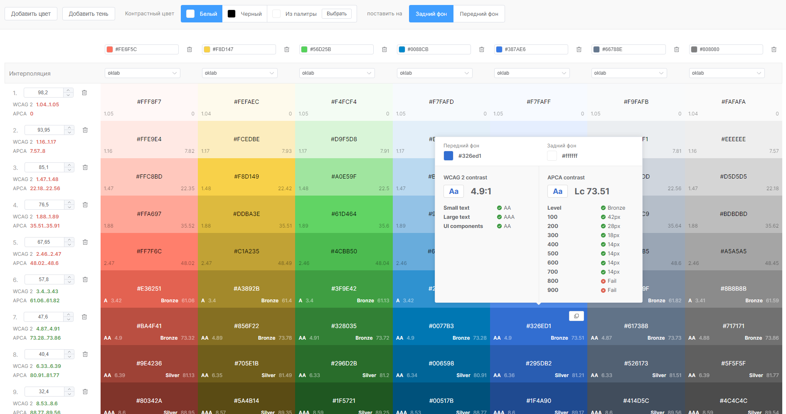

# Палитра дизайн-системы

Инструмент служит для создания цветовых палитр, используемых в дизайн-системах.

## Возможности

Инструмент умеет:
- Рассчитывать оттенки базового цвета относительно заданным теням и интерполяции по цветовому пространству
- Рассчитывать коэффициенты контрастности по двум стандартам: WCAG 2 и APCA
- Выводить данные по контрастности как в рассчитанную палитру, так и отдельно по каждому оттенку цвета при наведении на него
- Копировать цвет (hex-формат) в буфер обмена при наведении на него и нажатии на кнопку копирования
- Запоминать введенные цвета, интерполяции и значения теней в ссылке (таким образом можно использовать ссылку в обмене между дизайнерами)

## Как работает палитра?

В этом инструменте используется библиотека [chroma.js](https://github.com/gka/chroma.js) для того чтобы корректировать постоянную яркость между уровнями цвета. 

Выбранное по-умолчанию цветовое пространство __OKLAB__ обуславливается большей чистотой оттенков цвета, при построении градиента __черный цвет__-__базовый цвет__-__белый цвет__. С исследованиями можно ознакомиться по ссылкам: [создатель Oklab](https://bottosson.github.io/posts/oklab/), [хороший обзор на Oklab](https://raphlinus.github.io/color/2021/01/18/oklab-critique.html)

## Расчет коэффициентов контрастности

В инструменте есть поддержка коэффициентов __контрастности__. В данном случае есть поддержка [WCAG 2](https://www.w3.org/Translations/WCAG20-ru/) и [APCA](https://git.apcacontrast.com/documentation/README). На панель сверху выведены настройки расчета контрастности: каков будет контрастный цвет (возможность его выбора из белого, черного и вручную из созданной палитры), на какой план поставить контрастный цвет (передний фон или задний фон). 

Для удобства все коэффициенты и уровни доступности (по стандартам WCAG 2 и APCA) выведены как на сами тона базового цвета, так и суммарные величины высчитанного контраста выведены под значением тона (или тени).

При наведении на тон базового цвета в палитре будет доступна суммарная характеристика контрастности по двум стандартам. 

### Расчет WCAG 2

В стандарт WCAG 2 будет входить 3 правила по которым будет выводиться посчитанный уровень доступности контраста. 

Всего уровней **три**: 
- __A__ - низкий уровень доступности
- __AA__ - средний уровень доступности
- __AAA__ - высокий уровень доступности
- __Fail__ - это не уровень, а просто вывод в случае, если коэффициент ни одному из уровней не удовлетворяет

Правил тоже **три**: 
- __Small text__ - размер текста меньше 18pt
- __Large text__ - размер текста больше 18pt
- __UI components__ - это графические элементы, например иконки

### Расчет APCA

В стандарт APCA входят также 3 уровня:

- **Bronze**
- **Silver**
- **Gold**

Для инструмента был сделан расчет на вес шрифта. Этот стандарт позволяет рассчитывать контрастность цвета и выставлять минимальный размер шрифта на его жирность (благодаря таблице шрифта, [онлайн-пример](https://www.achecks.org/apca-wcag-3-accessible-colour-contrast-checker/)). Соответственно в правилах будут заданы все веса шрифта (100, 200, 300 и до 900), а напротив будет дан минимальный размер шрифта, который будет допустим для этого коэффициента контрастности.

Соответствие **числового веса** шрифта к названию:
- **100** - Thin
- **200** - Extra Light
- **300** - Light
- **400** - Regular
- **500** - Medium
- **600** - Semi-Bold
- **700** - Bold
- **800** - Extra-Bold
- **900** - Black